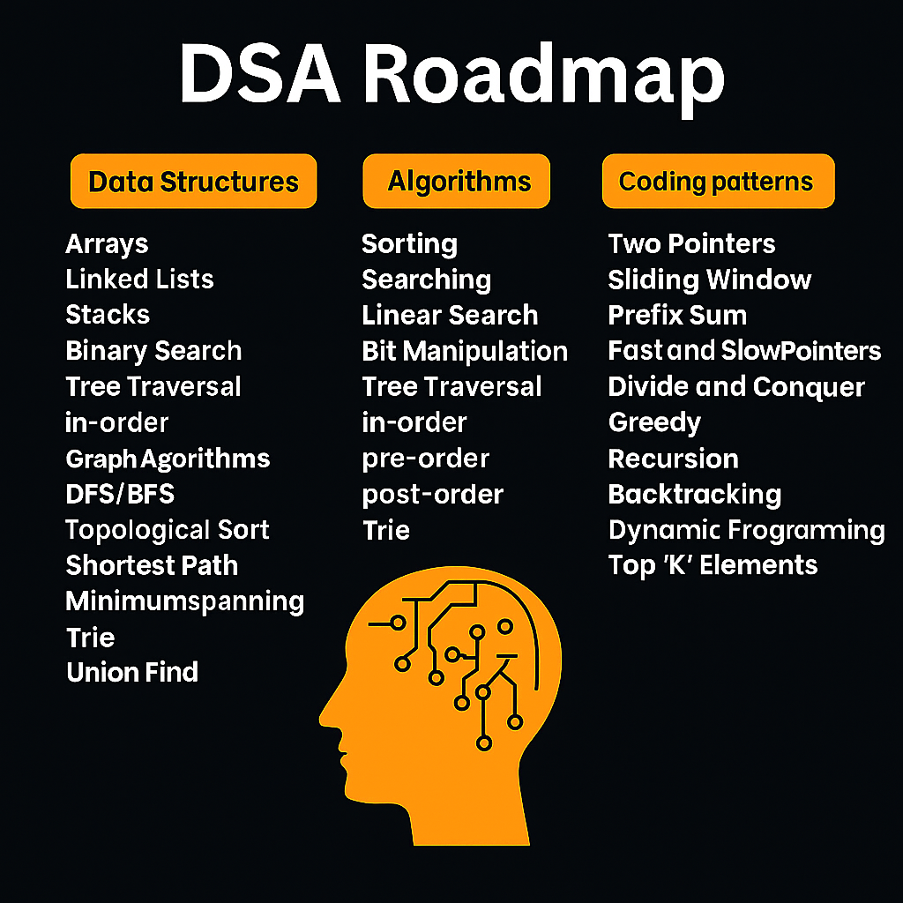

# 🚀 Data Structures & Algorithms (DSA) Roadmap



---

## 📖 What is DSA?

Data Structures and Algorithms (DSA) are at the **core of computer science**. They provide the building blocks for writing efficient, scalable, and maintainable software. Mastering DSA is not just about passing interviews — it’s about learning how to think like a problem solver.

A strong command over DSA helps you:

* 📌 Analyze and optimize the performance of your programs.
* 📌 Tackle real-world problems with efficient solutions.
* 📌 Crack coding interviews at top companies like Google, Meta, Microsoft, and Amazon.
* 📌 Build a solid foundation for advanced subjects like Operating Systems, Databases, Networking, and AI.

---

## 🧭 Why This Roadmap?

This roadmap gives you a **step-by-step journey**:

1. **Start with Basics**: Time Complexity & Space Complexity.
2. **Master Core Data Structures**: Arrays, Linked Lists, Stacks, Queues, Trees, Graphs.
3. **Dive into Algorithms**: Searching, Sorting, Recursion, and Greedy approaches.
4. **Learn Advanced Topics**: Dynamic Programming, Graph Algorithms, and Advanced Patterns.

By the end of this roadmap, you will:

* Be confident in solving problems on platforms like LeetCode, Codeforces, and HackerRank.
* Have a strong portfolio of solved problems.
* Be ready for coding interviews and competitive programming.

---

## 📂 How to Get Started

Clone this repository to explore the roadmap and practice resources:

```bash
# Clone the repo
git clone https://github.com/your-username/dsa-roadmap.git

# Navigate into the folder
cd dsa-roadmap
```

---

## 🗂️ Roadmap Overview

### 🔹 Basics

* Time & Space Complexity
* Big-O, Omega, and Theta Notation
* Analyzing Algorithms

### 🔹 Data Structures

* Arrays & Strings
* Linked Lists
* Stacks & Queues
* Trees & Binary Trees
* Graphs (BFS, DFS, Shortest Paths)

### 🔹 Algorithms

* Searching (Binary Search)
* Sorting (Merge Sort, Quick Sort, Heap Sort)
* Recursion & Backtracking
* Greedy Algorithms
* Dynamic Programming

### 🔹 Coding Patterns

* Sliding Window
* Two Pointers
* Divide & Conquer
* Recursion Tree
* Memoization & Tabulation

---

## 🏆 Why Learn DSA?

* 🧩 Improve problem-solving skills.
* 💼 Ace technical interviews.
* 🚀 Build efficient software systems.
* 🏆 Compete in programming contests.
* 🔮 Strengthen the foundation for advanced CS domains.

---

## 🤝 Contributing

We welcome contributions! 🎉 If you have:

* Better explanations
* Additional practice problems
* Visual diagrams

Feel free to fork the repo and submit a pull request.

---

## ⭐ Support

If this roadmap helps you, please **star this repo** ⭐ to support and help others discover it.

---

## 📧 Contact

📩 For queries and discussions:

* GitHub Issues
* Email: [your-email@example.com](mailto:your-email@example.com)
